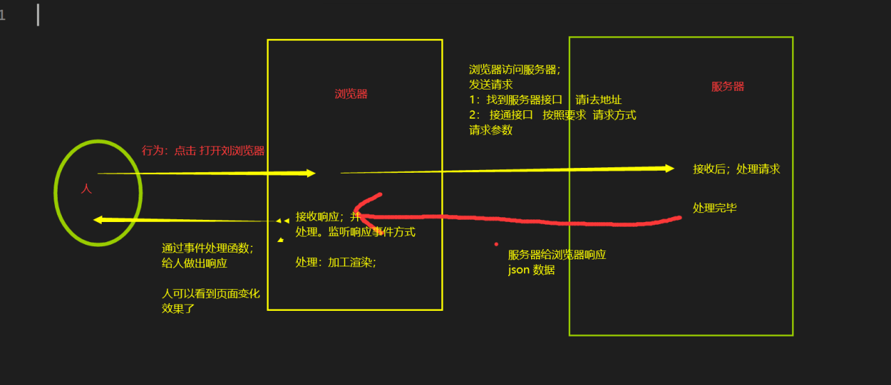

### 交互过程

### 服务器
- ip 找到服务器
- 端口号：找到服务
- /a/b 找到接口：要json苏剧

一个【服务器】可以启动【多个服务】,一个服务可以写【多个接口】，每个接口可以【响应数据】，数据格式为xml或者json格式

### 浏览器是如何发送请求
1：通过【请求地址】找接口
  - 404没找到 地址错误 或者找到了没响应
2：按照接口要求接通接口
  - 要求一：指定【请求方式】 get post pull delete
  - 要求二：需要【请求参数】 数据格式有所不同 例如：json格式 json 字符串 json对象

以上都满足后：接口接通 服务器处理请求 ----> 服务端开发人员的工作

### 如何接收响应并处理
1：怎么接收？
  1.1 响应内容：全部放在 XmlHttpRequest 对象中
  1.2 通过监听【响应事件】 XmlHttpRequest.onreadyStateChange
  1.3 在响应事件处理函数内容：处理响应数据
   - XmlHttpRequest.status 获取http 状态码
   - XmlHttpRequest.readyStatus 获取状态
   - XmlHttpRequest。respose 获取【响应体】中数据 (json数据或 xml)

2：怎么处理？
  2.1 根据dom 结构：分析页面需要的数据结构
  2.2 将响应数据加工处理，等到符合页面的数据结构
  2.3 通过 事件处理 完成js动态交互

3：注意事项：
  交互是异步的，事件处理函数 ajax 请求
  响应处理需要等待响应成功：再处理
   - 1 dom 处理在响应处理函数里面写
   - 2 要么在回调函数中处理dom，再响应处理函数中【执行回调函数】，并传入实参响应数据
   - 再回调函数的方法体中 接收【响应数据】，并进行dom处理

### 有没有什么状态是记录请求与响应的过程了
- 【0】 请求准备中 open()之前
- 【1】 发送请求了 send()之后
- 【2】 服务器处理中(java开发做的事)
- 【3】 响应发出中  (java开发的工作)
- 【4】 响应成功，浏览器接收响应 

0 1 4 前端开发的工作  2  3 服务端开发的工作

### http 状态码
代表了通信中 问题：
- 200 通信成功
- 400 前端bug
- 404 地址错误85% 或者没有响应15%
- 500 服务器错误